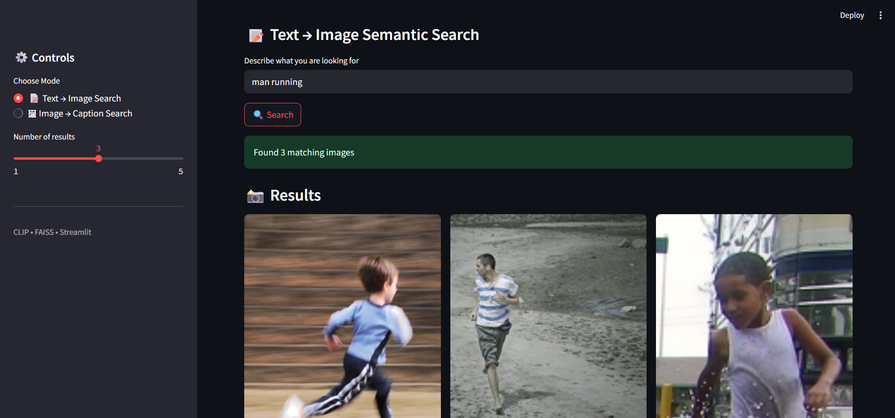
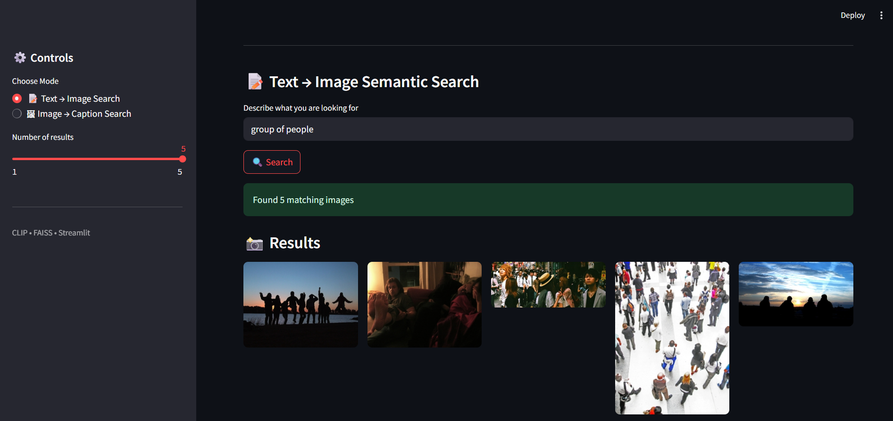
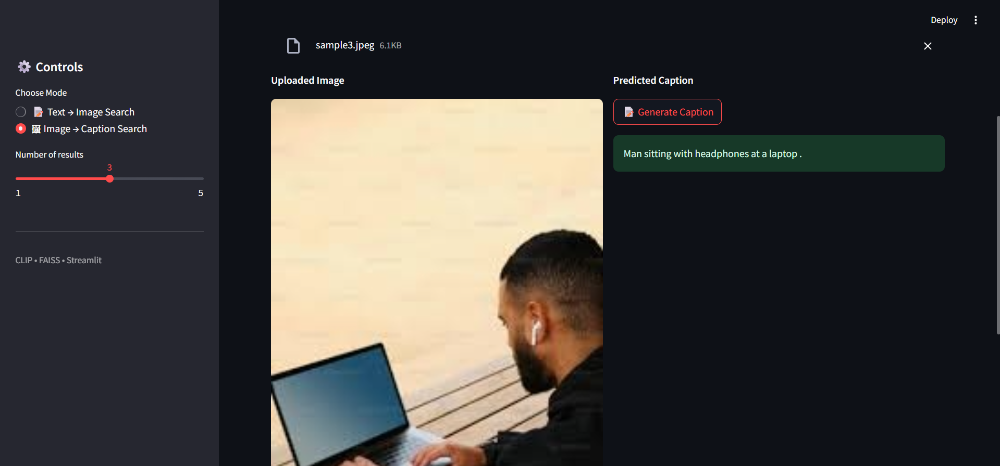
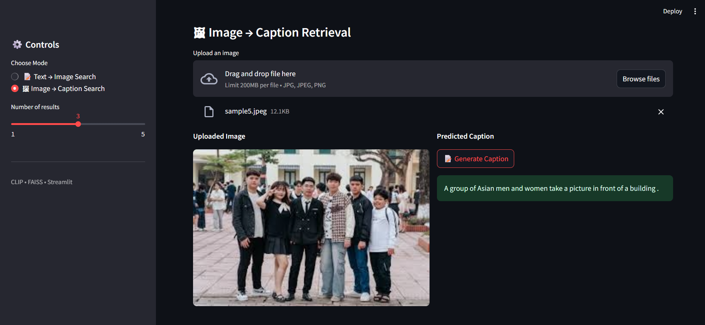

# 🔍 CLIP Semantic Search Engine

A **bidirectional multimodal semantic search system** built using **CLIP embeddings** and a **Vector Database (FAISS)**, supporting scalable **Text → Image** and **Image → Caption** retrieval over a large image dataset.

This project demonstrates how modern AI systems combine **representation learning** with **Vector Databases** to enable fast, zero-shot semantic search.

---

## 🚀 Features

- 🔁 **Bidirectional Retrieval**
  - **Text → Image** semantic search
  - **Image → Caption** semantic retrieval (retrieval-based, not generation)

- ⚡ **Scalable Vector Search**
  - Uses a **Vector Database (FAISS)** for efficient similarity search
  - Designed to scale beyond brute-force approaches
  - Supports 30k+ images with low latency

- 🧠 **Zero-Shot Learning**
  - No task-specific training or fine-tuning
  - Uses pretrained CLIP to generalize to unseen data

- 🖥️ **Interactive Web UI**
  - Built with Streamlit
  - Clean, responsive layout with result grids

- 🧩 **Modular System Design**
  - Clear separation between embedding generation and retrieval
  - Pluggable **Vector Database** layer
  - Easy to extend to larger datasets or new domains

---

## 🧠 How It Works

1. Images and text are encoded into a shared semantic space using **CLIP**
2. Image embeddings are normalized for cosine similarity
3. All image embeddings are indexed using a **Vector Database (FAISS)**
4. At query time:
   - **Text → Image**: text embedding is searched against image vectors
   - **Image → Caption**: image embedding is matched against caption vectors
5. Similarity is computed **on demand** using cosine similarity

> No similarities are precomputed.  
> The **Vector Database** stores only embeddings and performs similarity search at query time.

---

## 🔍 Why a Vector Database Is Used

For small datasets, brute-force cosine similarity is feasible.  
However, as the dataset grows, this approach does not scale.

This project uses a **Vector Database (FAISS)** to:

- Replace brute-force similarity computation
- Enable fast nearest-neighbor search in high-dimensional space
- Provide a scalable retrieval abstraction
- Support future growth to hundreds of thousands or millions of images


---

## 🧠 Role of the Vector Database in the Pipeline

1. CLIP produces high-dimensional semantic embeddings
2. These embeddings are indexed inside a **Vector Database**
3. At query time, the **Vector Database** efficiently retrieves the most relevant vectors
4. Retrieved indices are mapped back to original images or captions

This separation allows:
- CLIP to focus on semantic representation
- The **Vector Database** to focus on scalable retrieval

---

## ⚙️ Vector Database Design Choice

- **FAISS IndexFlatIP**
  - Exact cosine similarity search
  - Chosen for correctness and simplicity
  - Easily replaceable with approximate indexes (IVF / HNSW) for larger scale

Even though IndexFlatIP performs exact search, using a **Vector Database** ensures:
- Clean system abstraction
- Production-style architecture
- Easy transition to approximate search when needed

---

## 🖼️ Supported Modes

### 📝 Text → Image Search
- User provides a natural language query
- **Vector Database** retrieves top-K semantically similar images

### 🖼 Image → Caption Retrieval
- User uploads an image
- System retrieves the most semantically similar caption from the dataset

⚠️ Captioning is **retrieval-based**, not generative.

---

## 🧰 Tech Stack

- **Model**: CLIP (ViT-B/32)
- **Vector Database**: FAISS
- **Frontend**: Streamlit
- **Backend**: PyTorch
- **Similarity Metric**: Cosine similarity
- **Deployment**: CPU-based hosting

---

## 📦 Installation

```bash
pip install -r requirements.txt
```

---

## ▶️ Run Locally

```bash
streamlit run app.py
```

---


## 🧪 Design Decisions

- CLIP used in **zero-shot mode**
- CPU-only execution for easy deployment
- **Vector Database** replaces brute-force similarity search
- Exact search chosen initially for correctness

---

## 🚧 Limitations

- Captioning is retrieval-based, not generative
- CLIP is not trained for medical diagnosis
- Large datasets may exceed free hosting limits

---

---

## 🎬 Demo Preview

Below are example snapshots from the application UI.

⚠️ Live deployment may be temporarily unavailable due to hosting constraints.
The application runs locally using the instructions below.

### 📝 Text → Image Search



### 🖼 Image → Caption Retrieval




## 🔮 Future Work

- Approximate **Vector Database** indexes (IVF / HNSW)
- Multi-dataset or domain-specific search
- Full-scale deployment with externally hosted media (e.g., cloud storage/CDN) to support displaying the complete 30k-image dataset while keeping the Vector Database unchanged


---

## 🏆 What This Project Demonstrates

- Multimodal representation learning
- Scalable semantic search using a **Vector Database**
- Practical ML system design
- End-to-end deployment readiness

---


